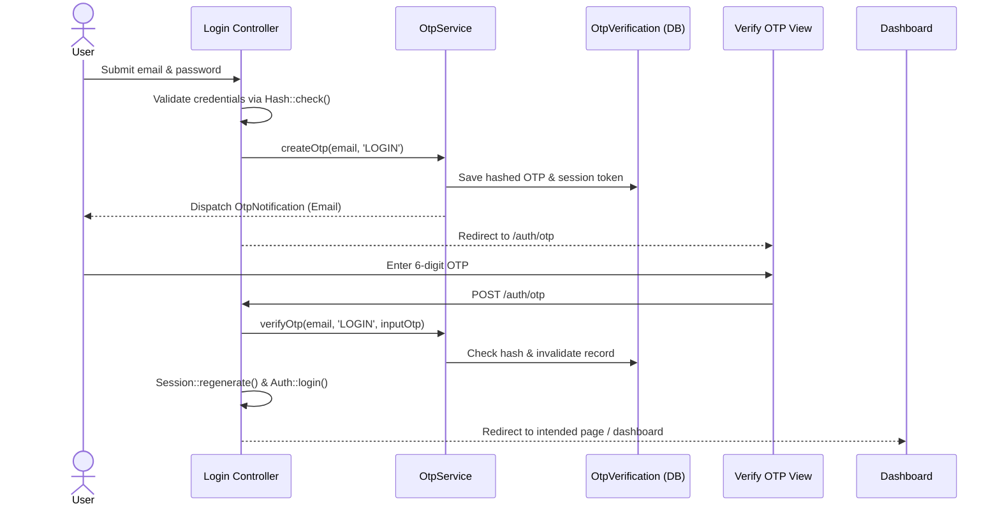
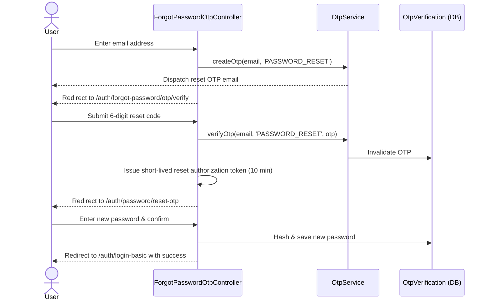

# AK-Mart — Authentication & OTP Architecture

## Overview
AK-Mart features a production-grade, cryptographically secure OTP authentication layer built cleanly on top of Laravel 12, Jetstream, and Sanctum.

---

## 1. OTP Security Design Principles

1. **Zero Plaintext Storage**: OTPs are generated cryptographically using `random_int(0, 9)` and stored as Bcrypt hashes via `Hash::make()`.
2. **Single-Use Enforcement**: Upon successful verification or when max attempts are exceeded, `is_invalidated` is set to `true` and `verified_at` is timestamped. Replay attacks are rejected.
3. **Purpose Isolation**: Every OTP is strictly bound to a purpose (`LOGIN`, `PASSWORD_RESET`, `EMAIL_VERIFICATION`, `PHONE_VERIFICATION`). An OTP issued for `LOGIN` can never verify a `PASSWORD_RESET` flow.
4. **Session Token Binding**: A random cryptographic session token binds the OTP verification to the current browser session.
5. **Rate Limiting & Anti-Brute-Force**:
   - Verification attempts per OTP: 5 maximum (`otp.max_attempts`)
   - Generation / Resend rate limiting: 10 per IP per minute via `RateLimiter`
   - Resend cooldown: 60 seconds (`otp.resend_cooldown`)
   - Maximum resends per flow: 3 (`otp.max_resends`)
6. **No Leakage**: OTPs are never included in URLs, localStorage, HTML comments, or server debug logs.

---

## 2. Authentication Flows

### A. Login with OTP


### B. Forgot Password via OTP


---

## 3. Database Schema (`otp_verifications`)

| Column | Type | Description |
|---|---|---|
| `id` | `BIGINT UNSIGNED` | Primary Key |
| `user_id` | `BIGINT UNSIGNED (NULL)` | Foreign key to `users.id` |
| `identifier` | `VARCHAR(255)` | Email or phone number |
| `purpose` | `VARCHAR(50)` | `LOGIN`, `PASSWORD_RESET`, etc. |
| `otp_hash` | `VARCHAR(255)` | Bcrypt hash of OTP |
| `session_token` | `VARCHAR(255) (NULL)` | Session binding token |
| `expires_at` | `TIMESTAMP` | Expiration datetime (default: 5 min) |
| `verified_at` | `TIMESTAMP (NULL)` | When verified |
| `attempts` | `TINYINT UNSIGNED` | Failed verification attempts count |
| `max_attempts` | `TINYINT UNSIGNED` | Threshold (default: 5) |
| `resend_count` | `TINYINT UNSIGNED` | Number of times resent |
| `max_resends` | `TINYINT UNSIGNED` | Threshold (default: 3) |
| `last_sent_at` | `TIMESTAMP (NULL)` | Timestamp of last dispatch |
| `ip_address` | `VARCHAR(45)` | Client IP address |
| `user_agent` | `VARCHAR(512)` | Client user agent |
| `is_invalidated`| `BOOLEAN` | Hard invalidation flag |

---

## 4. Configuration (`config/otp.php`)

```php
return [
    'length'                 => (int) env('OTP_LENGTH', 6),
    'expiration'             => (int) env('OTP_EXPIRATION', 5),      // minutes
    'resend_cooldown'        => (int) env('OTP_RESEND_COOLDOWN', 60), // seconds
    'max_attempts'           => (int) env('OTP_MAX_ATTEMPTS', 5),
    'max_resends'            => (int) env('OTP_MAX_RESENDS', 3),
    'rate_limit'             => (int) env('OTP_RATE_LIMIT', 10),
    'login_enabled'          => (bool) env('OTP_LOGIN_ENABLED', true),
    'password_reset_enabled' => (bool) env('OTP_PASSWORD_RESET_ENABLED', true),
    'default_channel'        => env('OTP_DEFAULT_CHANNEL', 'email'),
    'reset_auth_expiry'      => (int) env('OTP_RESET_AUTH_EXPIRY', 10), // minutes
];
```
