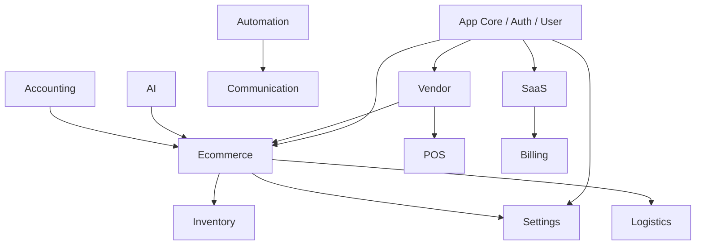

# AK-Mart — Module Dependency & Interaction Matrix

| Source Module | Dependent Module | Interaction Purpose |
|---------------|------------------|---------------------|
| **Ecommerce** | **Settings** | Fetches active currency, tax rates, checkout thresholds |
| **Ecommerce** | **Inventory** | Checks stock levels, decrements inventory upon order placement |
| **Ecommerce** | **Logistics** | Calculates carrier shipping rates & handles tracking numbers |
| **Vendor** | **Ecommerce** | Manages products, categories, branch inventory |
| **SaaS** | **Billing** | Enforces plan usage limits & generates subscription invoices |
| **Automation** | **Communication**| Triggers transactional emails and WhatsApp dispatches |
| **AI** | **Ecommerce** | Generates SEO product descriptions, extracts attribute tags |